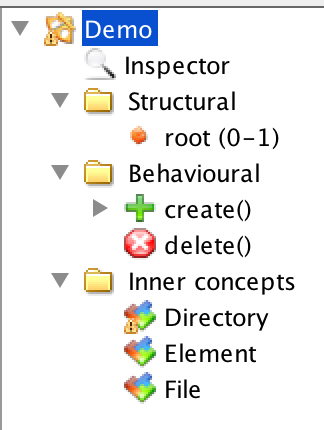
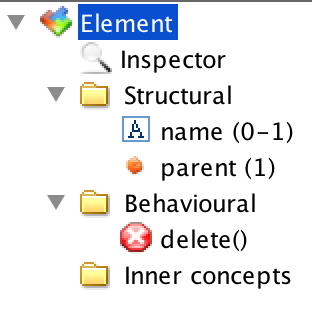
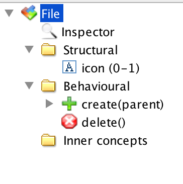
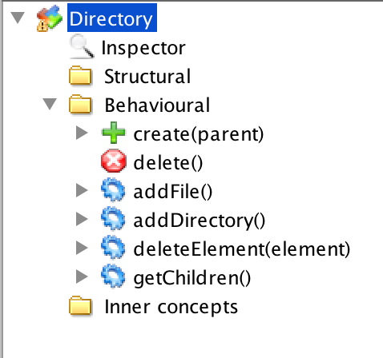

# OpenFlexo Demo Server

This code contains a demo for OpenFlexo as a server for multiple clients. 
The demo is visible **[here](https://server.openflexo.org)**.

The server is built using the OpenFlexo HTTP server, more information 
[here](https://github.com/openflexo-team/openflexo-http/blob/1.9.0/src/site/GettingStarted.md).

## The server

The server for the demo does not contain any specific Java code it uses a FML model for the buisness logic.
The model is called `Demo` and is in the `demo.pr j` OpenFlexo project. 
The model represents a tree structure of files and directories. 

Virtual Model | Element | File | Directory
------------- | ------- | ---- | ---------
|  | | | 

You can download the latest 1.9.0 version of OpenFlexo [here](https://downloads.openflexo.org) to open and edit the model.

## The client

The client side is in the folder `webroot`. 
The main application is in [`js/demo/App.ts`](webroot/js/demo/App.ts) where it construct uses a `BoundTree` to present the tree structure.

The server logs are visible [here](https://server.openflexo.org/logs.html).

## Deployment

The gradle build contains a simple start/stop mechanism to deploy the application:
`./gradlew -DDEST=/dest startApp`
